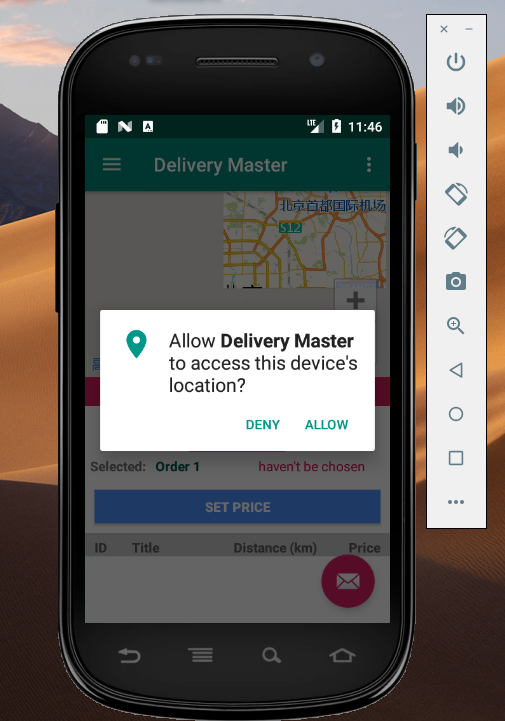

# DeliveryMaster

## Introduction

**Delivery Master** is an Android mobile phone delivery platform with delivery agents as the user group. The main features includes:

- User (delivery agent) can choose possible orders.
- User can see  daily statistics.
- User can track the movement by map location with GPS and see the displayed position.
- User can see  the pickup and delivery point on the map.
- User can ask for a path when start to delivery.
- User can set the price.
- User can change the status of the orders.

## Demo Instructions

- Install ` DeliveryMaster.apk`
- Open `Delivery Master`
- Allow location

- The Main Page will show.

- Green points are pick-up points and red points are delivery points. "Rest" means the user is not deliverying now, which is user status. Users can select orders by click the item and the above text view will show the selection.
- **Please use (29.82681, 121.546337) as the default start points in the simulator so it will look like above.** 
- Selected Order 1, Set Price. Please use integer.

- After setting the price, the new price of the order 1 will auto update in the main page. And order status turns to "price successfully set"

- Click Select Order Button to start. The user status will turn to "deliverying". And order status will turn to "pending pick up". Also, the real path from current position the pick up point will show based on Amap's search service.

- Click Picked Up Button. Another real path from pick up point to delivery point will show. Since the demo "order1" uses the path given in the gpx file. During this time, can run the GPS simlutor and the program will track the movement.

- Click Delivered Button to finish. The system will also broadcast the news.

- Click left up icon to open sidebar. It contains the user info and three items.

- Click Statistics will show daily data.

## Requirements

Based on the coursework requirement, the brief description of the requirements document is under the folder `documents/requirements`. According to the understanding and analysis of the scene, there are mainly two main objects here. **Users and orders**. From the whole scene, users can be divided into system administrators, merchants, and delivery agents according to different roles.

In addition to the two main objects, the **map** is a very important part of the information carrier for this scene. 

## Design

### Data Model

The data model is an abstract representation of the scene. Because of the need for persistent storage of data in Android programs, the hierarchical structure which contains SQLite, the data model, business logic and UI presentations are used.

### Database Model

It is worth noting that although there is only one user at present, the user table is not implemented for the requirements of this project. However, the design of the user table is advantageous for subsequent horizontal expansion. For example:

- Log in and log out.
- Access control based on uer type.
- Food factory can send orders instead of our fake orders.
- Clear user context in system programming.

### Map Selection

Although Google Maps has very good integration with Android components in development and is easy to develop, this project is not used because it cannot pass normal access requests outside the teaching area.

**Amap** (<https://lbs.amap.com/>) is considered in this project to be used because of its very mature map and friendly API development documentation.

### User Status & Order Status

- User Status 
  - rest
  - deliverying
- Order Status
  - haven't be chosen
  - price successfully set
  - pending pickup
  - picked-up
  - delivered

## Implementation

### Code Structure

### Components

#### Activity

- MainActivity
- MyStatisticsActivity
- SetPriceActivity
- AboutActivity

#### Content Provider

- MyProvider
- MyProviderContract

#### Broadcast Receiver

- MyReceiver

#### Service

Based on the current response of each component, no longer long-term logic needs to be extracted into the service. In fact, many listeners and services in Amap have been packaged.

